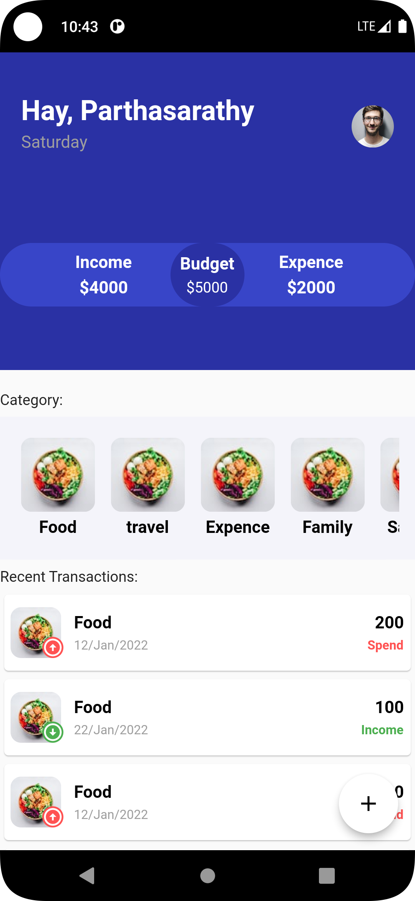

# MoneyManager
This app used to mange your daily expence and life with self balanced. it is helpful to visualise clearly.

## FrameWork
1. Flutter

## Language:
1. Dart

## Tools:
1. Git
2. Android studio / Vscode

## Pre-requirement:
1. Flutter 3.3.10
2. Dart 2.18.6
3. simple_speed_dial: ^0.1.7

# Cli command
## check your flutter support info:

```
flutter doctor
```
## dependancy install / package install:
```
flutter pub get
```
## Run methods:
```
flutter run
```
### ✌&ensp;Preview

|  Home Layout Transaction Preview   |     Transaction Popup Preview     |
|:----------------------------------:|:---------------------------------:|
|  |  |
